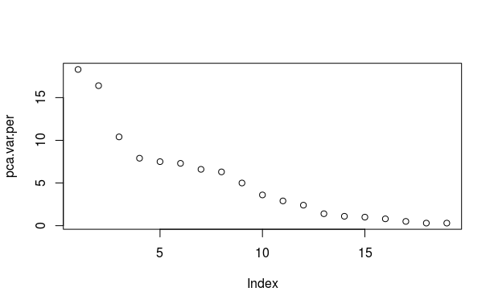
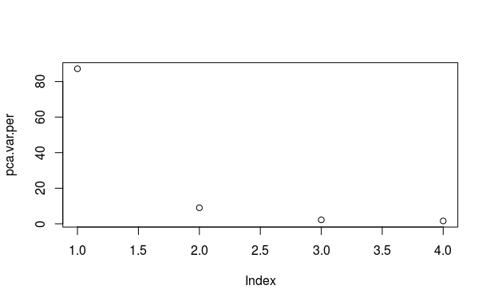

---
title:
   - PCA
author:
   -  Мартин Върбанов 165 спец Статистика
header-includes:
   - \usepackage{tikz}
   - \usepackage{pgfplots}
   - \usepackage[bulgarian]{babel}
---

# Table of Content
+ What is PCA
+ How to use it
+ 

# What is PCA
+ PCA is a method for dimension reduction

# DATA

+ Source: https://archive.ics.uci.edu/ml/datasets/EEG+Eye+State#
+ 19 features from Electroencephalography sensors; 1 feature representing if eye is opened or closed

# TODO log regression FUll data

+ First We try a logistic regression on all features and see results;
+ My aim is to make a PCA -> log regression and then compare result;

# TODO FULL PCA

+ First We do A full PCA on all features(except the result feature)
+ We get Variance of the factors is too smalls and we must use 5 PCs to reach 80% variance
+ PC1 has Var of 18% which is too smal

# Plot Full PCA

# Selecting features with maximum magnetude

loading_scores <- full_pca_train$rotation[,1]

sensor_scores <- abs(loading_scores) ## get the magnitudes

sensor_score_ranked <- sort(sensor_scores, decreasing=TRUE)

top_10_sensors <- names(gene_score_ranked[1:10])

top_10_sensors ## show the names of the top 10 genes

[1] "X6"  "X5"  "X7"  "X4"  "X3"  "X8"  "X19" "X9"  "X10" "X16"

\bigskip

But if we want to use them in a logistic model, how do we choose how man of them to choose

# Let's pick all of them

full_magnetude_model = glm.fit <- glm(result ~ X3+X4+X5+X6+X7+X8+X9+X10+X16+X19, data = train)

full_magnetude_predict = predict(full_magnetude_model, newdata=test)

full_magnetude_results <- ifelse(full_magnetude_predict > 0.5, 1, 0)

true_results = test$result

table(full_magnetude_results,true_results)

# Results

$\begin{bmatrix}
           & 0 & 1 \\
    0 & 86  & 53 \\
    1 & 21 & 71
\end{bmatrix}$

# Explanation
+ If we pick only the best features, we get a result which is weaker than if we take all the subjects

# Proprietary PCAs
+ We Will select only specific features to make PCA

# PCA by corelation
+ Lets select our top 5 features with biggest corelation towards the wanted output 

# Corelation between eye state and features

> cor_table["result",]

[0.0628162508; -0.0769254158;  0.2926029110;  0.2663378517;  0.2346910985;  0.1975108984; 
 0.1616306742; 0.1278607878;  0.0580148247;  0.0004790855;  0.0382814237;  0.1042544888; 
 0.1422728633;  0.1514243876; 0.1847720945;  0.1773128303;  0.0084663109; -0.0308676736; 
-0.0421439497;  1.0000000000] 

# PCA with hight correlation with result

# Results
+ In this case PC1 accounts for more than 80% of variances
