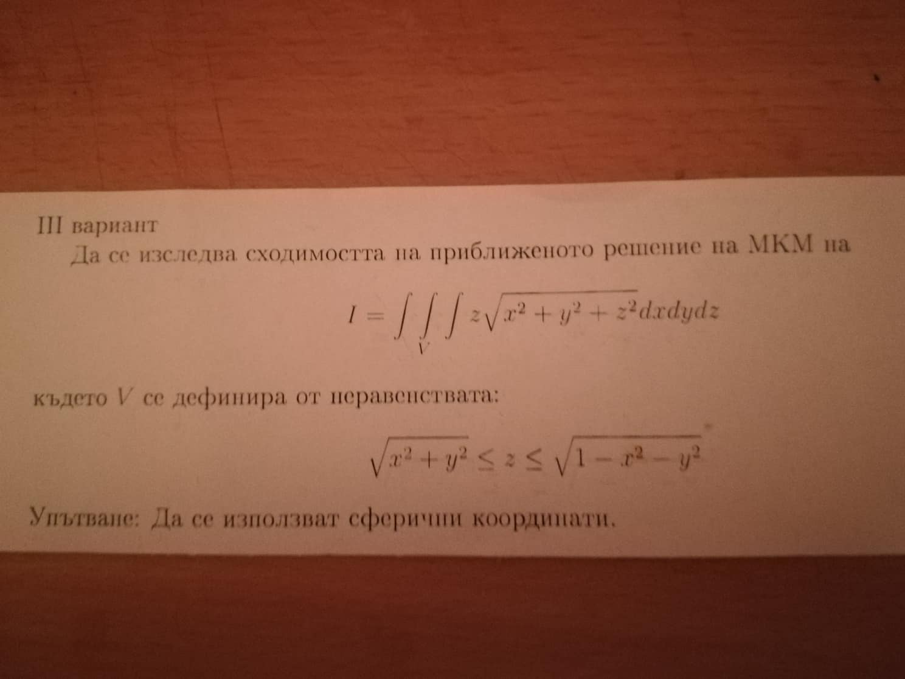
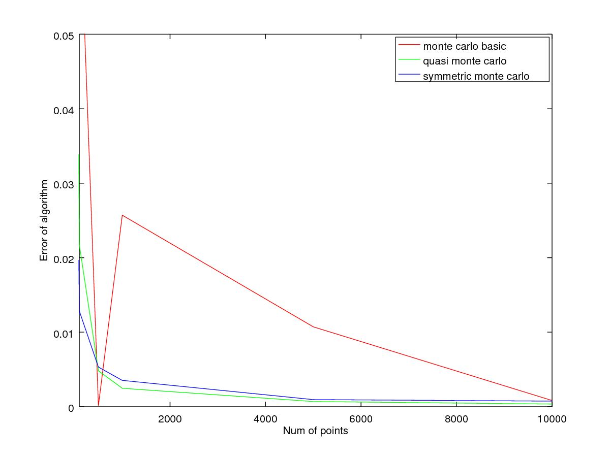
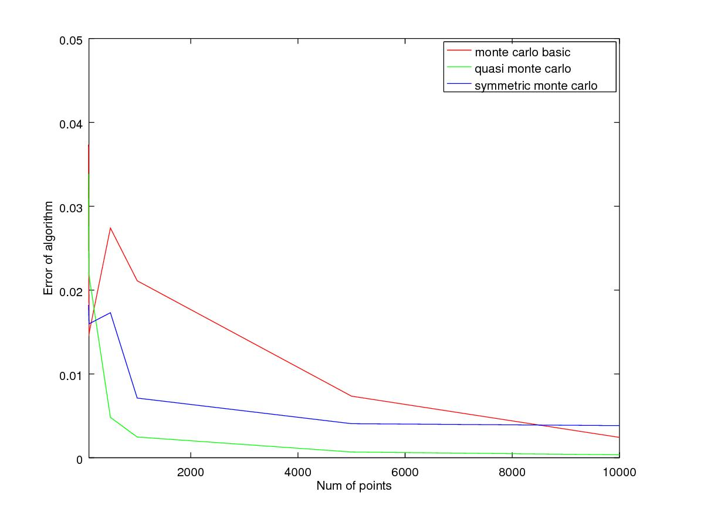
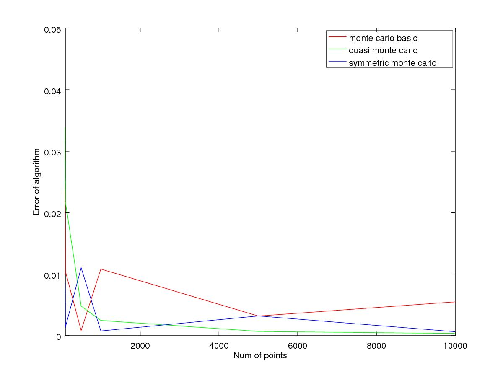
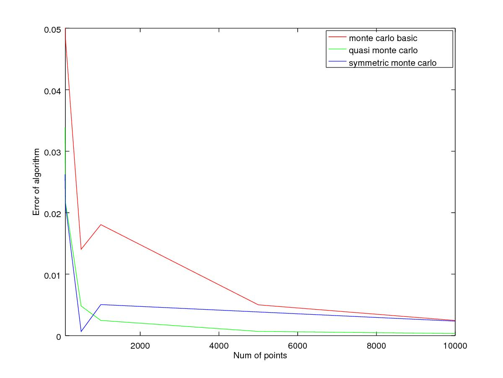
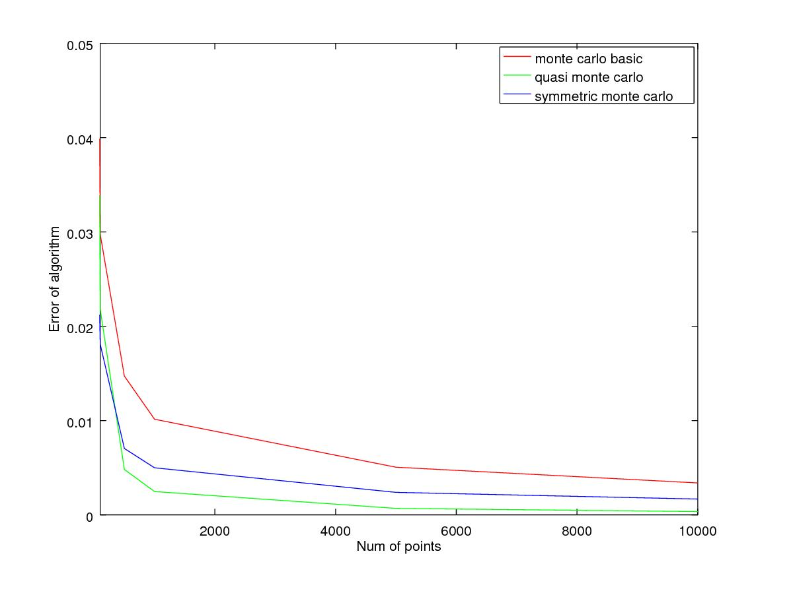

---
header-includes:
   - \usepackage{tikz}
   - \usepackage{pgfplots}
colortheme:
- fly
---

#Table of Content

+ the problem
+ analytical solution
+ basic monte carlo
+ quasi monte carlo
+ symmetric monte carlo
+ results

#The Problem

# Solution

$\int_{0}^{2\pi} \int_{0}^{\pi/4} \int_{0}^{1} r^{4} cos(\theta) sin(\theta) drd\theta d\psi = \pi / 10$

# Solution

$I_{1} = \int_{0}^{2\pi} d\psi$ 

$I_{2} = \int_{0}^{\pi/4} cos(\theta) sin(\theta) d\theta$

$I_{3} = \int_{0}^{1} r^{4} dr$

$I = I_{1}I_{2}I_{3} = \pi /10$

# Basic monte carlo

+ $I = \int_a^{b} f(x) dx$ - Integral
+ n - size; $\Delta = b-a$ 
+ $x_{1},..,x_{n}, x_{i} \in [a,b]$
+ $y_{i} = \frac{f(x_{i})\Delta}{n}$
+ $I = \sum_{i=1}^{n} y_{i}$
+ error - $O(N^{-1/2})$

# Vand der Corput

+ corput(n, b), n-size, b-base
+ The algorithm splits 1D axis to n intervals by base b

# Vand der Corput

\begin{tikzpicture}
\draw[white, thick] (0,0) -- (10,0);
\filldraw[black] (0,0) circle (2pt) node[anchor=west] {0};
\filldraw[black] (10,0) circle (2pt) node[anchor=west] {1};
\filldraw[black] (5,0) circle (2pt) node[anchor=west] {0.5};
\end{tikzpicture}

\begin{tikzpicture}
\draw[white, thick] (0,0) -- (10,0);
\filldraw[black] (0,0) circle (2pt) node[anchor=west] {0};
\filldraw[black] (10,0) circle (2pt) node[anchor=west] {1};
\filldraw[black] (5,0) circle (2pt) node[anchor=west] {0.5};
\filldraw[black] (2.5,0) circle (2pt) node[anchor=west] {0.25};
\filldraw[black] (7.5,0) circle (2pt) node[anchor=west] {0.75};
\end{tikzpicture}

\begin{tikzpicture}
\draw[white, thick] (0,0) -- (10,0);
\filldraw[black] (0,0) circle (2pt) node[anchor=west] {0};
\filldraw[black] (10,0) circle (2pt) node[anchor=west] {1};
\filldraw[black] (3.3,0) circle (2pt) node[anchor=west] {0.33};
\filldraw[black] (6.6,0) circle (2pt) node[anchor=west] {0.66};
\end{tikzpicture}

# Halton

+ $S_{b}(n) := \frac{\pi_{b}(d_{0})}{b} + \frac{\pi_{b}(d_{1})}{b^{2}} + ...+ \frac{\pi_{b}(d_{j})}{b^{j+1}}$, $\pi_{b}$ - permutations

+ $x_{n} = (S_{b1}(n),...,S_{bs}(n)),n=0,1,...$
+ Halton returns a matrix nxb

#Halton

\begin{tikzpicture}
\draw[white, thick] (0,0) -- (5,0);
\draw[white, thick] (0,0) -- (0,5);
\draw[white, thick] (2.5,0) -- (2.5,5);
\draw[white, thick] (5,0) -- (5,5);

\filldraw[black] (0,0) circle (2pt) node[anchor=west] {0};
\filldraw[black] (0,5) circle (2pt) node[anchor=west] {1};
\filldraw[black] (0,2.5) circle (2pt) node[anchor=west] {0.5};

\filldraw[black] (2.5,0) circle (2pt) node[anchor=west] {0};
\filldraw[black] (2.5,5) circle (2pt) node[anchor=west] {1};
\filldraw[black] (2.5,2.5) circle (2pt) node[anchor=west] {0.5};
\filldraw[black] (2.5,1.25) circle (2pt) node[anchor=west] {0.25};
\filldraw[black] (2.5,3.75) circle (2pt) node[anchor=west] {0.75};

\filldraw[black] (5,0) circle (2pt) node[anchor=west] {0};
\filldraw[black] (5,5) circle (2pt) node[anchor=west] {1};
\filldraw[black] (5,1.667) circle (2pt) node[anchor=west] {0.33};
\filldraw[black] (5,3.25) circle (2pt) node[anchor=west] {0.66};

\end{tikzpicture}

# Quasi monte carlo

+ Same algorithm as basic monte carlo
+ uses quasi random numbers

# Symmetric monte carlo

 + Same algorithm as basic monte carlo
 + $f(x_{i}) = \frac{f(x_{i}) + f(b-a-x-{i})}{2}$
 + no result in $x_{i} = \frac{b-a}{2}$

\begin{tikzpicture}
\draw[white, thick] (0,0) -- (10,0);
\draw[white, thick] (0,1) -- (10,1);
\draw[white, thick] (0,2) -- (10,2);

\filldraw[black] (0,0) circle (2pt) node[anchor=west] {0};
\filldraw[black] (10,0) circle (2pt) node[anchor=west] {10};
\filldraw[black] (5,0) circle (2pt) node[anchor=west] {5};

\filldraw[black] (0,1) circle (2pt) node[anchor=west] {0};
\filldraw[black] (10,1) circle (2pt) node[anchor=west] {10};
\filldraw[black] (4,1) circle (2pt) node[anchor=west] {4};
\filldraw[black] (8,1) circle (2pt) node[anchor=west] {8};

\filldraw[black] (0,2) circle (2pt) node[anchor=west] {0};
\filldraw[black] (10,2) circle (2pt) node[anchor=west] {10};
\filldraw[black] (7.5,2) circle (2pt) node[anchor=west] {7.5};
\filldraw[black] (2.5,2) circle (2pt) node[anchor=west] {2.5};
\end{tikzpicture}

#First Result

# Second Result

# Third Result

# Fourth Result

# After 100 iterations

